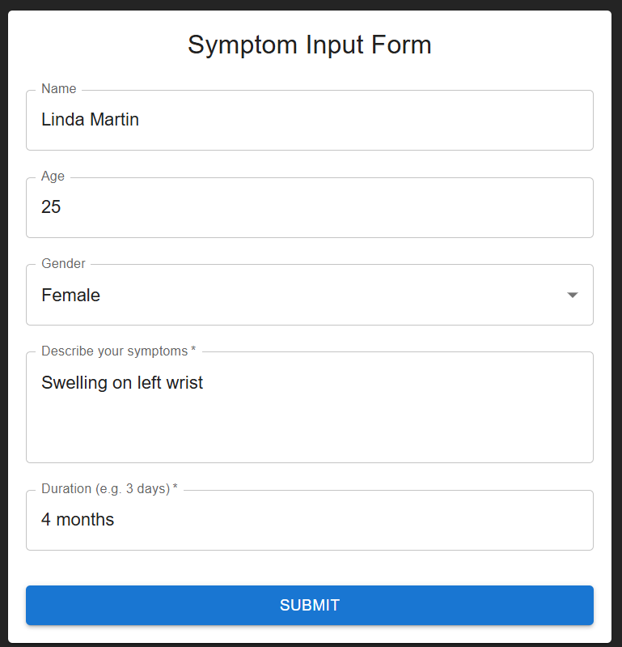
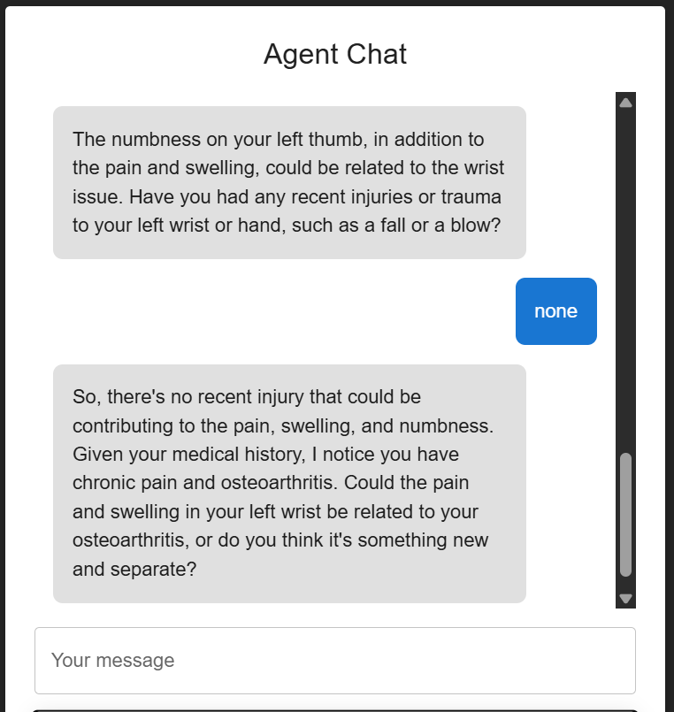
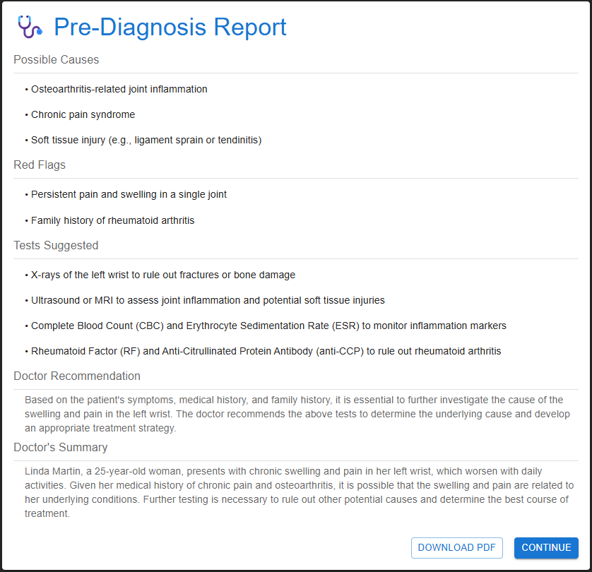

# healthmate-ai-diagnostic

AI Diagnostic Assistant:
HealthMate is an AI-powered assistant that simplifies pre-consultation by using a multi-agent system. It delivers a pre-screening diagnosis, lab test suggestions, and doctor recommendations before the patient meets a doctor—saving time and improving accuracy.
HealthMate is purpose-built for healthcare. Each agent handles a specific task—symptom intake, diagnosis, or doctor suggestion—while using patient history and structured analysis to offer actionable, reliable insights.

# Workflow:

1. The user logs in the application and a symptom form is displayed. The user provides basic details and the symtoms along with the duration. This data is collected by the "Symptoms Intake Agent" in the backend which feeds the LLM with the data along with the medical history of the user fetched from the database. This agent also asks follow up questions regarding the illness/condition for better clarity.
   
   
2. The symptoms are collected by the Diagnosis Agent which prepares a report based on the symptoms consisting of brief summary, red flags, recommended tests and a summary for the doctor. This is displayed in the UI which can be downloaded.
   
3. Finally, the user is directed to the recommended clinics/hospitals page. The "Doctor Agent" takes in the diagnosis summary and recommends appropriate doctors within the area. Ratings data of the hospitals is also provided.
   

# Steps to setup backend:

cd to backend directory
Create .env file and add the API key to the variable GROQ_API_KEY (Can get free API key at https://groq.com/)
Run the following commands one by one:

1. python -m venv venv
2. .\venv\Scripts\activate
   # If activation fails, run this:
   Set-ExecutionPolicy -Scope Process -ExecutionPolicy Bypass
3. pip install uvicorn fastapi python-dotenv pydantic requests
4. uvicorn app.main:app --reload

# Steps to setup frontend:

cd to healthmate-ui

1. npm install
2. npm run dev
3. open http://localhost:5173/ in the browser (Ensure backend is running first)
